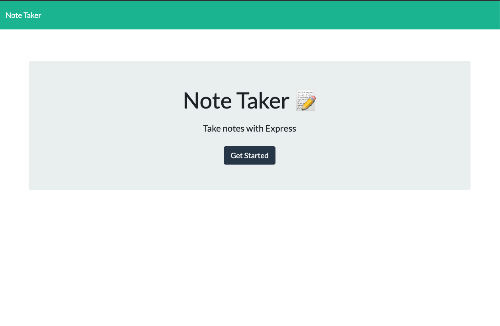
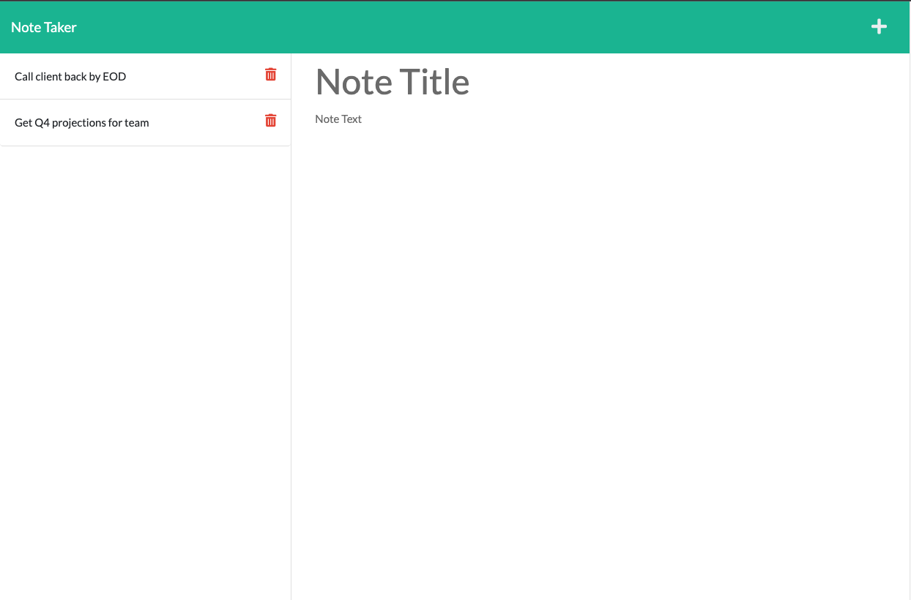

# Note Taker

## Description
For this challenge we were asked to create an application that can be used to write and save notes. This application uses Express.js on the backend to save and retrieve user-generated note data from a JSON file. The frontend has already been built. It is my job to build out the backend, create the connection between the two and deploy the finished product to Heroku.

## User Story
AS A small business owner 
I WANT to be able to write and save notes 
SO THAT I can organize my thoughts and keep track of tasks I need to complete

## Acceptance Criteria
GIVEN a note-taking application 
WHEN I open the Note Taker 
THEN I am presented with a landing page with a link to a notes page 
WHEN I click on the link to the notes page 
THEN I am presented with a page with existing notes listed in the left-hand column, plus empty fields to enter a new note title and the note’s text in the right-hand column 
WHEN I enter a new note title and the note’s text >
THEN a Save icon appears in the navigation at the top of the page 
WHEN I click on the Save icon 
THEN the new note I have entered is saved and appears in the left-hand column with the other existing notes 
WHEN I click on an existing note in the list in the left-hand column 
THEN that note appears in the right-hand column 
WHEN I click on the Write icon in the navigation at the top of the page 
THEN I am presented with empty fields to enter a new note title and the note’s text in the right-hand column 

## Links / Screenshots
https://note-taker-r.herokuapp.com/

## Credits
Tim Wardlow 
Instructors at UofM Full Stack Coding Boot Camp

## License
MIT

## Contact 
https://github.com/timothy-wardlow